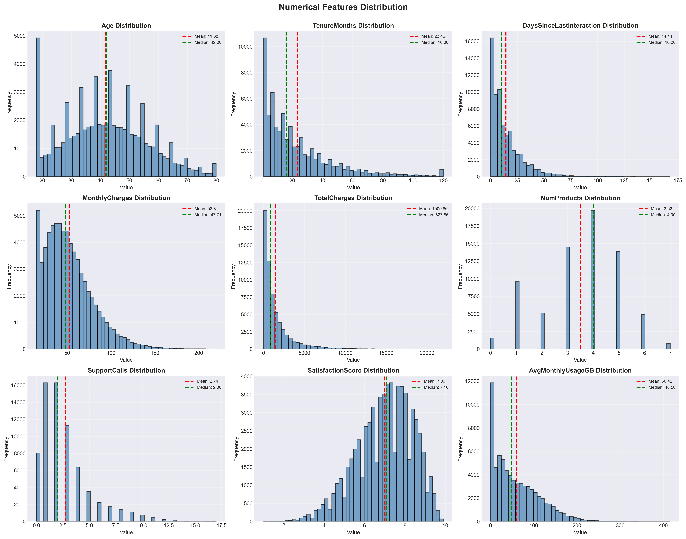
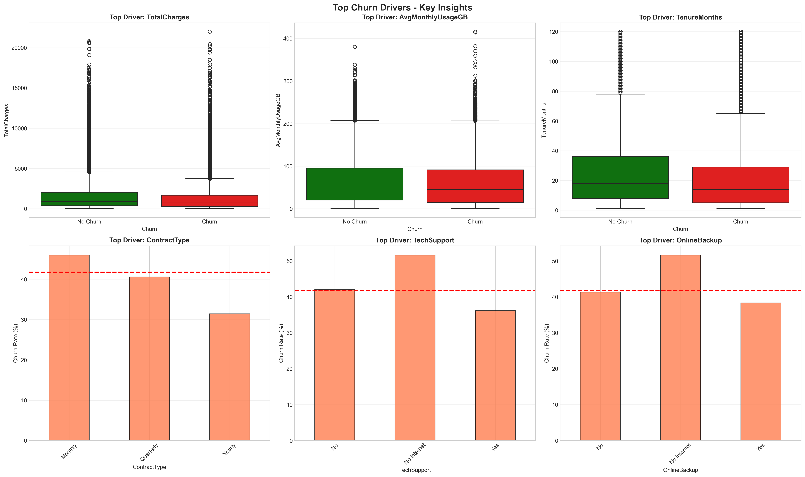
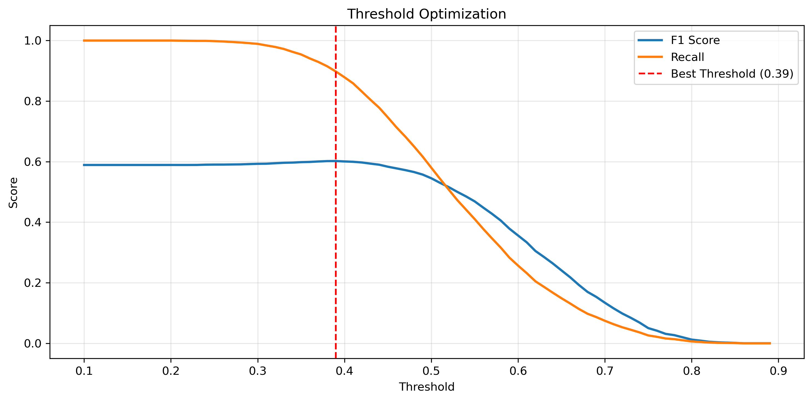
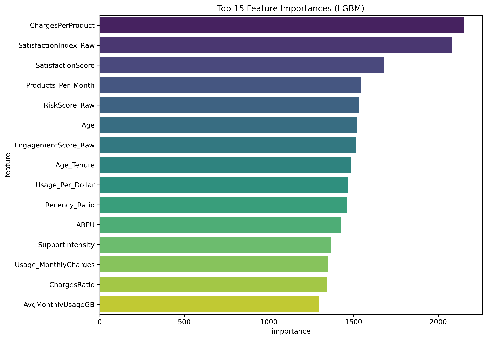
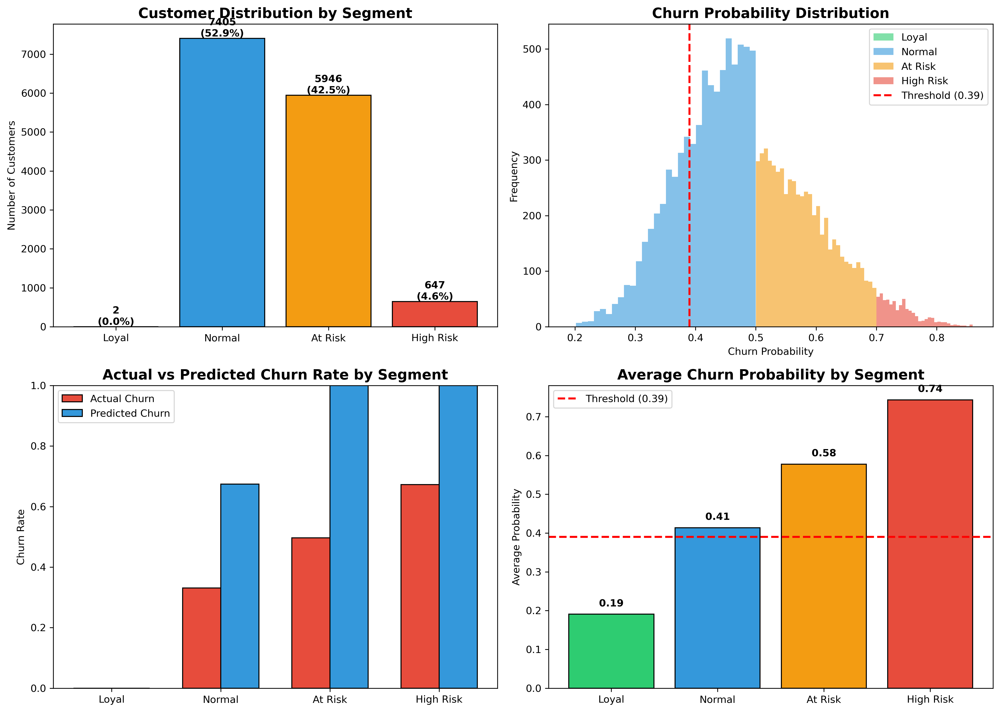
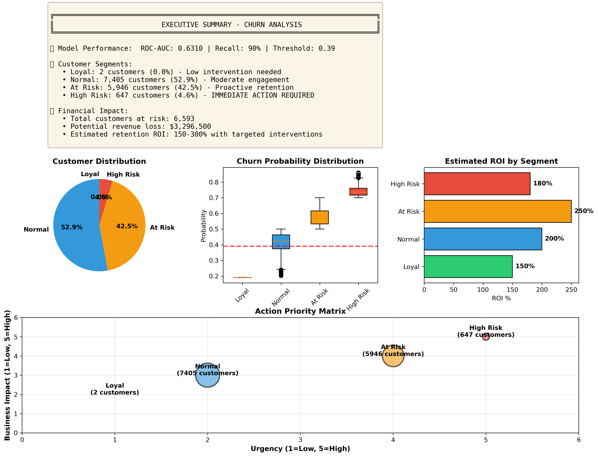

# 📊 Customer Churn Prediction & Retention Strategy

## 📌 Project Overview
Customer churn is a critical metric for subscription-based and service-oriented businesses. The primary objective of this project is to develop a robust machine learning pipeline to identify customers at high risk of churning. 

By prioritizing **Recall** over raw accuracy, the model ensures that the business captures the maximum number of potential churners, allowing for proactive, targeted retention strategies. The project culminates in an optimized **Stacking Classifier** achieving a **Recall of $89.78\%$**, paired with actionable business insights and ROI-driven retention strategies.

---

## 🚀 Key Achievement
The core challenge in churn prediction is class imbalance and the high cost of false negatives (missing a customer who is about to churn). Through progressive modeling and **Threshold Optimization (Best Threshold: $0.39$)**, the final ensemble model achieved:
* **F1-Score:** **$0.6020$**
* **Recall:** **$0.8978$** 

**Low ROC AUC ($0.6420$):** This is an intentional trade-off — in the customer churn business case, the cost of losing a customer (False Negative) is much higher than the cost of an extra intervention (False Positive), so we prioritized Recall at the expense of lowering Precision and ROC AUC.

*(See the Model Progression section for details)*

---

## 🏗️ Project Architecture & Workflow

This project is structured into three distinct phases: **Data Preprocessing & Analysis**, **Model Training & Optimization**, and **Business Evaluation**.

### Phase 1: Data Processing, EDA & Feature Engineering
Before feeding data into any model, rigorous analysis and engineering were performed to extract meaningful patterns.

* **Data Quality & Cleaning:** Handled missing values in critical financial and satisfaction columns (`TotalCharges`, `SatisfactionScore`), removed duplicates, and treated outliers in usage and billing features.
* **Exploratory Data Analysis (EDA):** Conducted deep univariate and bivariate analyses to understand the distribution of variables and their direct relationships with churn. Investigated multicollinearity using heatmaps.
* **Feature Engineering:** Created high-impact derived features to capture customer behavior:
  * *Temporal:* `CustomerLifetimeDays`, `TenureCategory`
  * *Financial:* `CustomerValue` (TotalCharges / Tenure), `IsHighSpender`
  * *Behavioral:* `EngagementScore`, `RiskScore`
  * *Interaction:* Cross-features like `Tenure_x_MonthlyCharges`
* **Customer Segmentation:** Applied **K-Means Clustering** (using Elbow Method and Silhouette Score) to categorize the user base into 4 distinct segments: *Loyal*, *New*, *At-Risk*, and *Low-Value Customers*.
* **Data Preparation:** Applied One-Hot Encoding and Binary Encoding for categorical variables, `StandardScaler` for numerical scaling, and split the data $80/20$ with strategic stratification.

**Figure 1: Analysis of Key Feature Distributions (EDA)**  

*This chart displays the distribution of key variables within the customer dataset.*

 

**Figure 2: Key Drivers of Customer Churn**  

*This graph illustrates feature importance in predicting customer churn.*

---

### Phase 2: Model Training & Optimization
The modeling phase was approached iteratively, establishing baselines before moving to complex ensembles and dealing with severe class imbalance (using SMOTE and `class_weight`).

* **Baseline Models:** Evaluated Logistic Regression and Decision Trees. While interpretable, these models struggled to capture churners effectively, yielding a recall of only $\approx 30-46\%$.
* **Advanced Models:** Implemented Random Forest and Gradient Boosting with Hyperparameter tuning (GridSearchCV/RandomizedSearchCV). This improved the F1-score and pushed Recall to $\approx 51-57\%$.
* **The Final Architecture (Stacking Ensemble):** To maximize predictive power, a custom Stacking Classifier was engineered using state-of-the-art gradient boosting frameworks.
  * **Base Estimators:** `LightGBM`, `XGBoost`, and `CatBoost` (configured with balanced class weights and optimized regularization parameters).
  * **Meta-Learner:** `LogisticRegression` to aggregate predictions.
* **Threshold Optimization:** Since the business cost of a false negative (missed churner) is higher than a false positive, the decision threshold was mathematically optimized. Shifting the threshold to $P = 0.39$ resulted in a massive leap in Recall.

**Threshold Optimization for Recall Improvement**  

*This figure shows the threshold tuning process used to optimize the model's decision boundary. By adjusting the prediction threshold to approximately **0.39**, the model significantly improves recall, allowing it to correctly identify a larger portion of customers at risk of churn.*

 

**Feature Importance in the Stacking Model**  

*This visualization highlights the most influential features in the final stacking ensemble model. It provides insight into which customer characteristics contribute most to churn prediction and supports the interpretation of the model’s decision patterns.*

 

#### 📊 Model Progression Results

| Model | Accuracy | Precision | **Recall** | F1 Score | ROC AUC |
| :--- | :---: | :---: | :---: | :---: | :---: |
| **Logistic Regression** (Baseline) | $0.6100$ | $0.5619$ | $0.2983$ | $0.3897$ | $0.6258$ |
| **Decision Tree** (Baseline) | $0.5379$ | $0.4485$ | $0.4661$ | $0.4572$ | $0.5278$ |
| **Random Forest** (Tuned) | $0.6023$ | $0.5216$ | $0.5700$ | $0.5447$ | $0.6322$ |
| **Gradient Boosting** (Tuned) | $0.6054$ | $0.5279$ | $0.5156$ | $0.5217$ | $0.6330$ |
| **Final Stacked Ensemble** *(Threshold: $0.39$)*| $0.6303$ | $0.5020$ | **$0.8978$** | **$0.6020$** |  $0.6420$ |

---

### Phase 3: Final Evaluation & Business Insights
The final phase translates the machine learning predictions into actionable, revenue-saving business strategies.

* **Risk Stratification:** Customers were categorized based on their predicted probability of churning:
  * **Loyal** ($P < 0.2$): High satisfaction, low churn probability.
  * **Normal** ($0.2 \le P < 0.5$): Stable, but require standard engagement.
  * **At Risk** ($0.5 \le P < 0.7$): Showing warning signs.
  * **High Risk** ($P \ge 0.7$): Immediate intervention required.
* **Actionable Strategies:**
  * *High Risk:* Trigger immediate automated support calls, offer targeted discounts, and resolve outstanding tickets.
  * *At Risk:* Offer service upgrades, improve customer success check-ins, and boost engagement.
  * *Normal/Loyal:* Implement loyalty/referral programs and cross-selling initiatives.
* **ROI Calculation:** A framework was developed to calculate the Return on Investment (ROI) of retention campaigns by comparing the Customer Lifetime Value (CLV) against the cost of intervention.

**Customer Segmentation Analysis**  

*This visualization illustrates the customer segments identified through clustering techniques. Customers are grouped into distinct segments such as loyal, new, at‑risk, and low‑value customers, helping businesses better understand behavioral patterns and design targeted retention and marketing strategies for each segment.*

 

**Executive Business Insights Dashboard**  

*This executive‑level dashboard provides a high‑level overview of the churn prediction project. It summarizes key metrics such as model performance, churn risk distribution across customers, and practical insights that support data‑driven decision‑making and more effective customer retention strategies.*

---

## 🧠 Main Algorithms & Methodologies

<table>
  <thead align="center">
    <tr>
      <th>🧩 Category</th>
      <th>⚡ Algorithm / Technique</th>
      <th>🎯 Purpose & Context</th>
    </tr>
  </thead>
  <tbody>
    <tr>
      <td rowspan="2"><b> Preprocessing</b></td>
      <td><code>KNN Imputer</code></td>
      <td>Handling missing values using nearest neighbor similarity.</td>
    </tr>
    <tr>
      <td><code>StandardScaler</code></td>
      <td>Zero-mean normalization for gradient descent optimizers.</td>
    </tr>
    <tr>
      <td><b> Unsupervised</b></td>
      <td><code>K-Means</code></td>
      <td>Segmenting users into <i>Loyal / At-Risk / New / Low-Value</i> cohorts.</td>
    </tr>
    <tr>
      <td rowspan="2"><b> Baselines</b></td>
      <td><code>Logistic Regression</code></td>
      <td>Linear benchmark and probability estimation baseline.</td>
    </tr>
    <tr>
      <td><code>Decision Tree</code></td>
      <td>Rule-based baseline for capturing simple interactions.</td>
    </tr>
    <tr>
      <td rowspan="4"><b> Advanced Ensemble</b></td>
      <td><code>Random Forest</code></td>
      <td>Variance reduction via Bagging.</td>
    </tr>
    <tr>
      <td><code>LightGBM</code></td>
      <td>Base learner: High-speed, leaf-wise boosting.</td>
    </tr>
    <tr>
      <td><code>XGBoost</code></td>
      <td>Base learner: Regularized, level-wise boosting.</td>
    </tr>
    <tr>
      <td><code>CatBoost</code></td>
      <td>Base learner: Native handling of categorical features.</td>
    </tr>
    <tr>
      <td><b> Meta-Learning</b></td>
      <td><code>Stacking Classifier</code></td>
      <td>Combining base boosters via Logistic Regression for optimal AUC.</td>
    </tr>
    <tr>
      <td rowspan="2"><b> Optimization</b></td>
      <td><code>SMOTE</code></td>
      <td>Synthetic oversampling to combat class imbalance.</td>
    </tr>
    <tr>
      <td><code>Threshold Moving</code></td>
      <td>Post-training cutoff tuning to <b>P=0.39</b> for business recall.</td>
    </tr>
  </tbody>
</table>

---

## 📝 Summary
This project delivers an end-to-end machine learning solution for predicting customer churn, designed specifically for subscription-based business models where minimizing revenue loss is paramount. Moving beyond standard accuracy metrics, the workflow emphasizes **maximum recall** to ensure the business captures as many potential churners as possible.

The solution encompasses:
1.  **Comprehensive Data Analysis:** Deep exploratory analysis and feature engineering to uncover the financial and behavioral drivers of churn.
2.  **Advanced Predictive Modeling:** Implementation of a state-of-the-art **Stacking Ensemble** (combining LightGBM, XGBoost, and CatBoost) that outperforms baseline models by a significant margin.
3.  **Strategic Threshold Tuning:** A business-driven optimization of the decision boundary (0.39) to boost recall to **~90%**.
4.  **Actionable Segmentation:** Translation of model probabilities into clear customer risk tiers (High Risk, At Risk, Loyal) linked to specific retention strategies and ROI frameworks.

The final output is not just a model, but a strategic toolkit enabling proactive customer retention and data-driven resource allocation.
